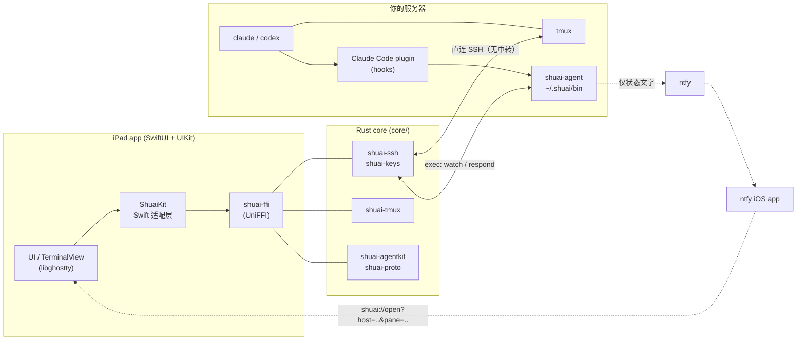

# shuai

开源 (MIT)、iPad 优先、**直连无中转**的「agent 感知 SSH 终端」。


## 定位

- **真终端**（libghostty 渲染）+ **tmux 原生化窗口管理**，充分利用 iPad 大屏、硬件键盘与 Stage Manager。
- **不包装 CLI**：通过 Claude Code plugin + hooks 感知会话，你照常在 tmux 里运行 `claude`（Codex 通过 notify 接入）。
- **Agent 会话仪表盘**：每个 tmux pane 的状态（工作中 / 等审批 / 等输入 / 完成 / 失败）、一键跳转、原生审批卡片。
- **直连、无中转**：App 直接 SSH 到你的服务器，没有任何 shuai 服务器；数据不经第三方云。可选的后台推送走 ntfy，且只发送状态文字。

## 功能（v1 现状）

- 主机管理；ed25519 / ECDSA 密钥生成，导入 OpenSSH / PKCS#1（含 AWS `.pem`）/ PKCS#8 / SEC1 私钥；私钥在 Keychain
- SSH：密码 / 密钥 / 键盘交互认证，TOFU 主机密钥校验（变更须明确确认），keepalive，断线自动重连
- tmux：自动 `tmux new -A -s <name>`，缺 tmux 时回落到普通 shell；侧栏会话/窗口/pane 树与服务器实时同步
- 终端：IME 内联预编辑、CJK/emoji、鼠标、bracketed paste、OSC 52/9/777、捏合与 ⌘± 缩放、Option 当 Alt、主题
- 键盘栏 + Claude 条（Yes=`1`、Always=`2`、No=Esc、⇧Tab、中断）；停靠/浮动栏随硬件键盘自动切换
- 硬件快捷键（⌘1–9、⌘T、⌘D、⌘K 快速切换器、⌘⇧A 跳到待处理 agent 等）
- 一键「Enable AI integration…」：安装 `shuai-agent`、Claude Code 插件、tmux 配置块，并可完整卸载
- 原生审批卡片（Allow / Deny，App 离线时无缝回落到 Claude 本地对话框）
- 后台通知（ntfy，status-only）与 `shuai://` 深链接跳转到对应 pane

## 架构



- `core/`：Rust workspace（平台无关）：`shuai-proto`、`shuai-keys`、`shuai-ssh`、`shuai-tmux`、`shuai-agentkit`、`shuai-ffi`（UniFFI 导出层）、`shuai-agent`（服务端 musl 静态二进制）。
- `apple/ShuaiKit`：Swift Package（`ShuaiCore` 绑定、`ShuaiPlatform`、`ShuaiTerminal`、`ShuaiApp`）。`apple/App`：iPad App（XcodeGen）。
- `plugin/` 与 `.claude-plugin/`：Claude Code 插件与 marketplace（`claude plugin marketplace add moilk/shuai`）。`android/`：预留。
- 终端引擎选型见 [ADR 0001](docs/adr/0001-terminal-engine.md)。

## 文档

- [在真实 iPad 上安装（免费 Apple ID）](docs/guide/install-ipad.md)
- [快速上手](docs/guide/getting-started.md)
- [真机首次测试清单](docs/guide/device-checklist.md)
- [架构决策记录](docs/adr/) · [里程碑计划](docs/plan/)
- [开发约定（CLAUDE.md）](CLAUDE.md)

## 状态与路线

- **v1 已完成**：Rust 核心与 FFI、SSH/密钥/TOFU/重连、终端（libghostty）、主机管理、tmux 原生化、Claude 集成（agent + plugin + 一键安装 + 徽章 + 原生审批 + Codex notify）、ntfy 后台通知与深链接。
- **待办（需要真机）**：中文拼音 IME 与硬件键盘的真机验证，见[真机测试清单](docs/guide/device-checklist.md)。
- **v1.x**：图片粘贴（SFTP 上传后插入路径）、语音听写、SFTP 浏览、Secure Enclave 密钥、主机配置 iCloud 同步。
- **v2**：自建 APNs relay + Live Activity / 锁屏审批、clean-room mosh（Rust）、完整 `tmux -CC` 原生分屏、多 agent 看板、Android app。
- 暂无付费 Apple 开发者账号：目前通过免费 Apple ID 自签安装（7 天有效期），没有 TestFlight / App Store 版本。

## 从源码构建（快速开始）

```sh
export DEVELOPER_DIR=/Applications/Xcode.app/Contents/Developer
cargo test --workspace --manifest-path core/Cargo.toml   # Rust 测试
scripts/build-agent.sh                                    # 交叉编译服务端 shuai-agent（需 zig + cargo-zigbuild）
scripts/build-xcframework.sh                              # xcframework + Swift 绑定
(cd apple/ShuaiKit && swift test)                         # Swift 包测试 (macOS)
(cd apple/App && xcodegen generate && xcodebuild test -scheme Shuai \
  -destination 'platform=iOS Simulator,name=iPad Pro 13-inch (M5)')
```

装到真机见[安装指南](docs/guide/install-ipad.md)。**不要发布用 `SHUAI_FFI_TESTKIT=1` 构建的 xcframework**（仅供开发/CI）。

## 参与贡献

- 有逻辑的地方严格 TDD：先提交失败的测试（`test: ...`），再实现（`feat: ...`）。
- 提交信息使用 Conventional Commits（feat / fix / test / docs / chore / ci / refactor）。
- Rust：`cargo test --workspace`、`cargo clippy --workspace --all-targets -- -D warnings`、`cargo fmt --check`。
- CI 使用 **Xcode 26.6**，比作者本地的 Xcode 27 旧，请避免只有新编译器接受的 Swift 写法。
- 更多约定（FFI 边界、终端模块、测试套件）见 [CLAUDE.md](CLAUDE.md)。

## 许可

MIT，见 [LICENSE](LICENSE)。

## English summary

shuai is an open-source (MIT), iPad-first SSH terminal that is aware of AI coding agents (Claude Code, and Codex via notify) running inside tmux. It connects **directly** to your server over SSH. There is no relay and no shuai cloud.

**Features (v1):** real terminal (libghostty) with CJK/IME support, tmux-native window management (sidebar tree, quick switcher, hardware shortcuts), a Claude key strip (Yes/Always/No), a per-pane agent status dashboard, native permission cards (when the app is offline Claude falls back to its own local dialog immediately), one-tap "Enable AI integration" that installs `shuai-agent` and a Claude Code plugin on the host (fully removable), and opt-in background notifications through ntfy that carry status text only (never commands, prompts or paths; tmux window names are off by default), with `shuai://` deep links back to the pane.

**Architecture:** a shared Rust core (russh, UniFFI) drives a native SwiftUI/UIKit iPad app; a small static Rust binary, `shuai-agent`, runs on the server and is driven by Claude Code plugin hooks. Android (Compose) is planned.

**Install on a real iPad with a free Apple ID** (no paid account; builds expire after 7 days and must be re-signed from Xcode): see [docs/guide/install-ipad.md](docs/guide/install-ipad.md) (Chinese). In short: install Xcode, Rust targets, xcodegen, zig and cargo-zigbuild; run `scripts/build-agent.sh` and `scripts/build-xcframework.sh` (normal mode, never ship a `SHUAI_FFI_TESTKIT=1` build); `cd apple/App && xcodegen generate`; open the project, pick your Personal Team and a unique bundle id, enable Developer Mode on the iPad, and trust your developer certificate. Then see the [getting started guide](docs/guide/getting-started.md) and the [device checklist](docs/guide/device-checklist.md).

**Contributing:** strict TDD where there is logic, Conventional Commits, and note that CI builds with Xcode 26.6. See [CLAUDE.md](CLAUDE.md).
