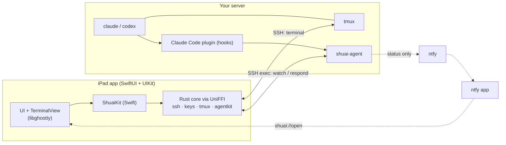

<p align="center">
  
</p>

<h1 align="center">shuai</h1>

<p align="center">
  <b>An AI-coding-aware SSH terminal for iPad.</b><br>
  <i>AI that leads your Shell.</i>
</p>

<p align="center">
  <a href="LICENSE"></a>
  
  
</p>

<p align="center">
  <a href="#why-shuai">Why</a> ·
  <a href="#features">Features</a> ·
  <a href="#how-it-works">How it works</a> ·
  <a href="#quick-start-build-from-source">Quick start</a> ·
  <a href="#documentation">Docs</a> ·
  <a href="README.zh-CN.md">简体中文</a>
</p>

shuai is a real terminal with native tmux navigation that knows what the Claude Code sessions on
your server are doing: which one is working, which one waits for your approval, which one is done.
It connects directly to your server over SSH; there is no relay and no shuai cloud. Open source
under the MIT license.

<p align="center">
  
</p>

## Why shuai

- **Agent-aware, not a wrapper.** You run `claude` inside tmux exactly as on a laptop. A Claude Code
  plugin reports hook events to a small helper on the server, and the app turns them into badges,
  attention navigation and native permission cards.
- **iPad-first.** libghostty rendering, inline IME (including Chinese pinyin), hardware keyboard
  shortcuts, Stage Manager, a key strip for Claude's dialogs.
- **Direct SSH, no relay.** Nothing between the iPad and your server. Optional background
  notifications go through ntfy and carry status only.
- **MIT.** App, Rust core, server agent and plugin.

## Features

- Hosts with password, key or keyboard-interactive auth; ed25519/ECDSA key generation; import of
  OpenSSH, PKCS#1 (including AWS `.pem`), PKCS#8 and SEC1 keys; keys in the Keychain.
- Trust-on-first-use host keys (a changed key needs explicit confirmation), keepalive, automatic
  reconnect.
- tmux: automatic `tmux new -A -s <name>`, plain-shell fallback without tmux, a live sidebar tree of
  sessions, windows and panes, context-menu actions, ⌘K quick switcher, hardware shortcuts.
- Terminal: inline IME, CJK and emoji, mouse, bracketed paste, OSC 52 (with confirmation) and
  OSC 9/777, pinch and ⌘± zoom, Option as Alt, dark and light themes.
- Keyboard bar plus a Claude strip (Yes = `1`, Always = `2`, No = Esc, ⇧Tab, interrupt); docked or
  floating, switching automatically with a hardware keyboard.
- One-tap **Enable AI integration** installs `shuai-agent`, the Claude Code plugin and a tmux config
  block over SSH, and removes them completely again.
- Per-pane agent badges (needs approval, needs input, failed, working, done, idle) and ⌘⇧A to jump to
  the next agent that needs you.
- Native permission cards (Allow / Deny with an optional message); when no app is watching, Claude
  falls back to its own dialog immediately.
- Codex support through its `notify` program (turn finished).
- Status-only background push through ntfy, with `shuai://` deep links to the pane.

## How it works



The terminal is tmux in a PTY channel. A second channel runs tmux in control mode to keep the
sidebar in sync. Claude Code hooks append events to `~/.shuai/events.jsonl`; the app follows them
with `shuai-agent watch` and answers permission requests with `shuai-agent respond`, all over the
same SSH connection. Details: [Architecture](docs/design/architecture.md).

## Quick start (build from source)

shuai is not on the App Store yet. Build it and install it on your iPad with a free Apple ID
(builds expire after 7 days and are re-signed from Xcode):

```sh
rustup target add aarch64-apple-ios aarch64-apple-ios-sim aarch64-apple-darwin \
  x86_64-unknown-linux-musl aarch64-unknown-linux-musl
brew install xcodegen zig && cargo install cargo-zigbuild --locked

scripts/build-agent.sh            # server agent binaries, bundled into the app
scripts/build-xcframework.sh      # Rust core + Swift bindings
cp apple/App/Local.xcconfig.example apple/App/Local.xcconfig   # set your team + bundle id
cd apple/App && xcodegen generate && open Shuai.xcodeproj
```

Full instructions, iPad setup and troubleshooting: [Installation](docs/user/installation.md). Then
read [Getting started](docs/user/getting-started.md).

## Documentation

- Users: [Installation](docs/user/installation.md) · [Getting started](docs/user/getting-started.md) ·
  [Claude Code integration](docs/user/claude-integration.md) · [Notifications](docs/user/notifications.md) ·
  [Keyboard shortcuts](docs/user/keyboard-shortcuts.md) · [Privacy and security](docs/user/privacy-security.md)
- Design: [Architecture](docs/design/architecture.md) · [Agent protocol](docs/design/agent-protocol.md) ·
  [tmux integration](docs/design/tmux-integration.md) · [Security model](docs/design/security-model.md) ·
  [Decisions (ADRs)](docs/adr/README.md)
- Development: [Building](docs/development/building.md) · [Testing](docs/development/testing.md) ·
  [CI](docs/development/ci.md) · [Release](docs/development/release.md) ·
  [Contributing](docs/development/contributing.md)
- Everything: [docs/README.md](docs/README.md)

## Status and roadmap

v1 is feature-complete; validation on real iPads (IME, hardware keyboards, background push) is
pending. Next: image paste via upload, an SFTP browser, Secure Enclave keys, iCloud sync of hosts,
shortcut customization. Later: an APNs relay with Live Activities, a clean-room mosh-compatible
transport, native tmux splits and an Android app. See the [roadmap](docs/roadmap.md).

## Contributing

Issues and pull requests are welcome. Please read [Contributing](docs/development/contributing.md):
test-first development, Conventional Commits, and the review checklist.

## License

[MIT](LICENSE)
