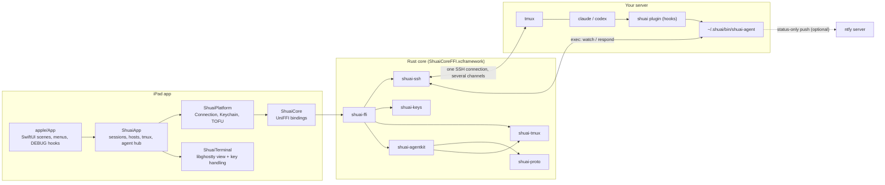
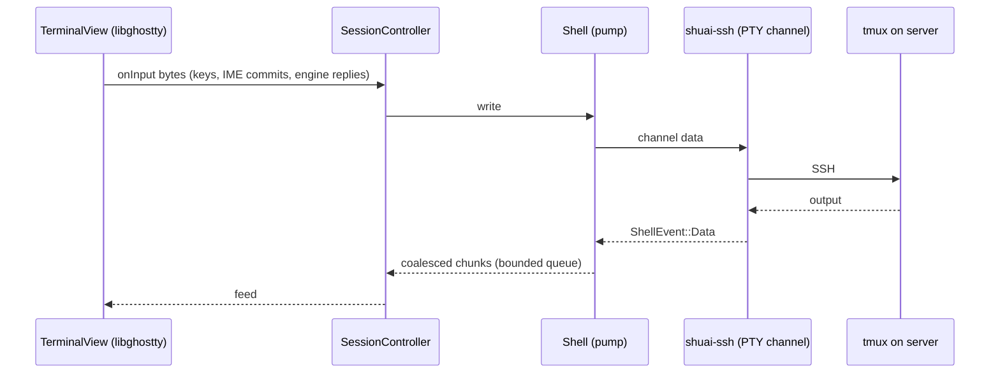
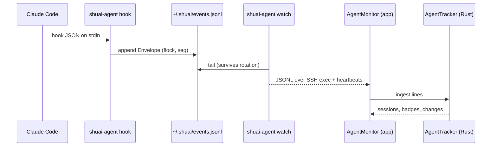
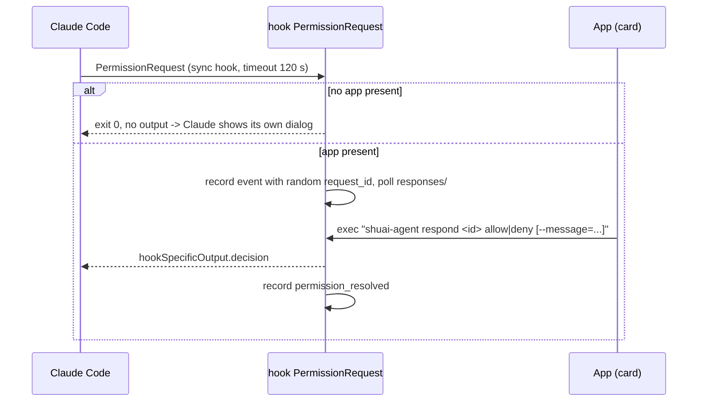

# Architecture

shuai has three parts:

1. a **Rust core** (`core/`) with all protocol and state logic, exported to Swift through UniFFI;
2. a **native iPad app** (`apple/`), SwiftUI + UIKit, terminal rendering by libghostty;
3. a **server side**: the `shuai-agent` binary plus a Claude Code plugin whose hooks call it.

## Rust crates (`core/`)

| Crate | Responsibility | I/O |
|---|---|---|
| `shuai-proto` | Wire types shared by app and agent: `Envelope`, `AgentEvent`, `PermissionResponse`, `WatchLine`, JSONL helpers, `PROTOCOL_VERSION` | none |
| `shuai-keys` | Key generation (ed25519, ECDSA), import (OpenSSH, PKCS#1 incl. legacy PEM encryption, PKCS#8, SEC1), export, fingerprints, randomart, `known_hosts` matching | none |
| `shuai-ssh` | Async SSH client on russh: auth (password, password prompt, key via signer, keyboard-interactive), PTY shell, exec channels, keepalive, upload; pure `ReconnectPolicy` state machine | network |
| `shuai-tmux` | Sans-io tmux helpers: quoted command builders, `-F` output parsing, topology tree and diff, control-mode (`-C`) parser, `TmuxController`, client targeting, layout strings, version capabilities | none |
| `shuai-agentkit` | Sans-io agent logic: `AgentTracker` (event stream to per-session state), reconciliation, install planning (probe script, steps), remote command builders, embedded plugin bundle, settings.json merge | none |
| `shuai-ffi` | UniFFI export layer over the crates above; thin adapters only | via shuai-ssh |
| `shuai-agent` | Server binary (static musl): hooks, `watch`, `respond`, ntfy push, `doctor` | files, processes, HTTP |
| `shuai-testkit` | Dev-only in-process russh server for tests; exported to Swift only behind the `testkit` feature | network |
| `uniffi-bindgen` | Binding generator used by `scripts/build-xcframework.sh` | build time |

Logic lives in the pure crates and is tested with `cargo test`. The core is platform-neutral so an
Android app can reuse it (see [ADR 0002](../adr/0002-rust-core-uniffi.md)).

## FFI boundary rules

- **Coarse API only**: session- and stream-level objects (`SshConnection`, `ShellStream`,
  `ExecStream`, `TmuxController`, `ReconnectPolicy`, the agent tracker). Never per-byte or per-cell
  calls. Terminal bytes go from the SSH stream straight to the platform terminal engine.
- **Records vs objects**: plain data (`KeyMaterial`, `FfiTopology`, events, config) are
  `uniffi::Record`/`Enum`; anything stateful or owning I/O is a `uniffi::Object`. tmux ids cross as
  strings (`$0`, `@1`, `%2`).
- **Errors**: one flat enum per domain (`FfiKeyError`, `FfiSshError`, `FfiTmuxError`,
  `FfiAgentError`), mapped from the pure crates; no panics cross the boundary.
- **Async**: `#[uniffi::export(async_runtime = "tokio")]`. Platform callbacks are foreign traits
  (`with_foreign`): host key verification, password and keyboard-interactive prompts are async
  (they ask the user); the signer is sync.
- **Keys** cross as unencrypted OpenSSH PEM strings; Swift stores them in the Keychain.

## Swift targets (`apple/`)

| Target | Language mode | Responsibility |
|---|---|---|
| `ShuaiCore` | Swift 5 | Generated UniFFI bindings + `ShuaiCoreFFI` binary target |
| `ShuaiPlatform` | Swift 6 | `Connection` actor, `Shell` / `ExecSession` stream wrappers with pumps, `KeychainKeyStore`, `KnownHostsStore` + `TOFUVerifier`, `ReconnectController` |
| `ShuaiTerminal` | Swift 6 | `TerminalEngine` protocol, `GhosttyEngine` and `TerminalView` (iOS only), key encoding fallback, accessory bar model, Option-as-Alt, theme, resize/font models |
| `ShuaiApp` | Swift 6 | Host profiles and stores, key library, `SessionController` state machine, `SessionRegistry`, tmux monitor/actions, agent hub/monitor/installer, push settings, deep links, shortcuts, quick switcher, SwiftUI pieces |
| `apple/App` (`Shuai`) | Swift 6 | App entry, root views, menus, settings, DEBUG launch arguments; links only the `ShuaiApp` product |

Everything except libghostty-dependent code builds on macOS, so most Swift logic is tested with
`swift test`; Ghostty-dependent code is `#if canImport(GhosttyTerminal)`.

## Data flows

### Terminal bytes

The PTY channel runs `tmux new -A -s '<name>'` as an exec command (no typed text). All bytes the
terminal produces, including engine replies to queries (DA1, DECRQM, kitty `CSI ? u`), go to the
remote.

**Drain requirement.** All channels of an SSH session share one connection task; a channel whose
buffer is full stalls every channel, keepalive included. Every open `ShellStream`/`ExecStream`
must therefore be read continuously until `Closed`, even when its output is ignored. The Swift
`Shell`/`ExecSession` wrappers start a pump per stream that feeds a byte-bounded, coalescing
queue (64 MiB per stream); terminal bytes are never dropped, and a full queue makes the pump wait,
which stalls the session until the consumer catches up. Never read a stream lazily from UI code.

### tmux side channel

A second channel on the same connection runs `tmux -C attach -t =SESSION:` (no PTY) and turns tmux
notifications into a live session/window/pane tree for the sidebar, quick switcher and shortcuts.
It never writes to the terminal. See [tmux integration](tmux-integration.md).

### Agent events

Per connected host, `AgentHub` probes the host (hostname, agent version, `claude` path) and runs
one `AgentMonitor`, which executes `~/.shuai/bin/shuai-agent watch --since <last seq>` and feeds
lines into the Rust tracker. History before the `caught_up` marker updates state silently; later
changes drive banners and notifications. A watchdog restarts a watch with no heartbeat for 25 s.
The UI keys hosts by `HostProfile.id`; the hub maps them to the remote hostname the agent reports.

### Permission round trip

The hook gives up after 110 s, or as soon as the app's presence lapses, and Claude falls back to its
own dialog. Details: [Agent protocol](agent-protocol.md).

### Push

When no app is present, hooks for attention-worthy events spawn a detached `shuai-agent push-send`
that posts a status-only message to ntfy. See [ADR 0005](../adr/0005-status-only-push-ntfy.md) and
[Notifications](../user/notifications.md).

## Connection lifecycle

`SessionController` (`@MainActor @Observable`) owns one host session: connect, host key
verification, auth, tmux attach (or plain-shell fallback), reconnect and teardown. Reconnects are
driven by `ReconnectController` over the Rust `ReconnectPolicy` (backoff, network path changes,
foreground events); after a reattach the window size is nudged to force a tmux redraw.
`SessionRegistry` holds the controllers and wires them to the `AgentHub`.
