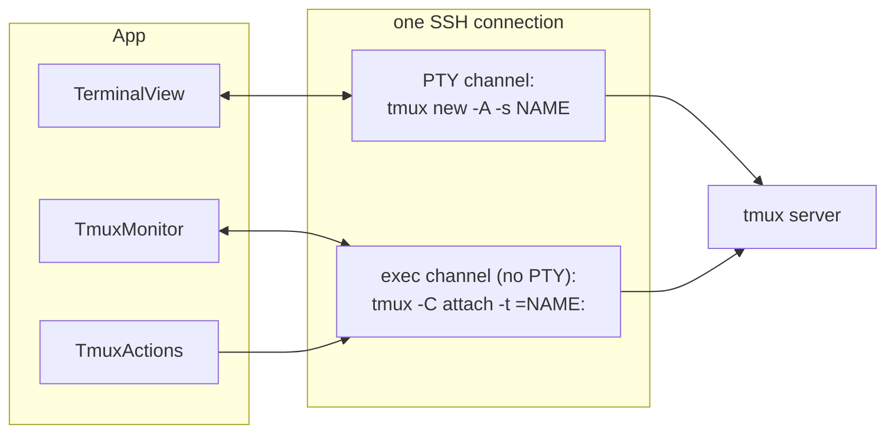

# tmux integration

shuai renders tmux in **one** terminal (the PTY client) and keeps a native model of the tmux server
next to it through a **control-mode side channel**. Native `tmux -CC` window/pane splitting is not
used. Rationale: [ADR 0006](../adr/0006-tmux-control-side-channel.md).

Code: `core/shuai-tmux` (sans-io parsing, commands, controller), `apple/ShuaiKit/Sources/ShuaiApp`
(`TmuxMonitor`, `TmuxActions`, `TmuxTree`, `ClientProcessTree`, `TmuxLaunch`).

## Two clients per host session

1. **PTY client**: `tmux new -A -s '<name>'` executed on a PTY channel. Everything the user sees.
2. **Control client**: `tmux -C attach -t =<name>:` on an exec channel. Its first stdin line is
   `refresh-client -f no-output`, so tmux sends notifications but no pane output. The channel is
   drained continuously like every other stream.

`TmuxMonitor` (one per `SessionController`, started after each attach, stopped on teardown):

- debounces structural notifications (`%window-add`, `%layout-change`, `%session-changed`, ...) by
  100 ms into one `list-panes -a -F …` plus `list-clients`, sent over the same channel;
- patches renames directly into the tree;
- publishes the topology and its diff to the sidebar, the quick switcher and the shortcuts.

The monitor never writes to the PTY, so the terminal is never moved by it.

## Client targeting

Commands sent over the control channel run *as the control client*. Anything that changes what the
terminal shows must name the PTY client explicitly: `TmuxActions` uses `switch-client -c <tty>` and
switches session first when acting on a window of another session.

Finding our PTY client's tty:

1. `list-clients` plus the control client's own pid (`display-message -p '#{client_pid}'`)
   identifies the control row; the PTY client is a non-control client of our session.
2. With several candidates (a laptop attached to the same session), `ClientProcessTree` runs
   `ps -A -o pid= -o ppid=` on the host and picks the candidate that shares the deepest ancestor
   with the control client, both being children of our SSH connection.
3. If that is not conclusive, the Rust heuristic `pick_pty_client` decides (matching size, age).

The tty is sticky for the lifetime of a monitor start (a client keeps its tty across
`switch-client`) and forgotten on every restart. Kill window/pane actions always go through a
confirmation.

⌘1–9 address windows by their position in the list, not by tmux index, so `base-index` does not
matter.

## Version compatibility

Supported: tmux **3.2 to 3.6** for the live side channel; older versions fall back to polling.

| tmux | Behaviour |
|---|---|
| < 3.2 | No control side channel; the topology is polled with one-shot `exec` every 2 s. |
| 3.2 – 3.6 | Control-mode side channel with `refresh-client -f no-output`. |
| missing / disabled | Monitor off; the session is a plain terminal (see plain-shell fallback). |

Capabilities are derived from `tmux -V` (`shuai_tmux::version`); development builds such as
`next-3.7` and `master` are understood.

### `-F` field separator

shuai formats `list-*` output with the unit separator `\x1f` between fields. tmux 3.2, 3.3 and 3.6+
print it raw; tmux 3.4 and 3.5 print it as the four characters `\037`. Field values are always
escaped by tmux, so an *unescaped* `\037` can only be a separator. Always split with
`shuai_tmux::parse::split_fields`, never `split(FIELD_SEP)`. A value containing a real 0x1f on 3.4/3.5
yields a wrong field count, which is rejected rather than misparsed.

Fixtures from each version live in `core/shuai-tmux/tests/fixtures/listpanes-tmux*.txt`; the
real-tmux tests can target a specific build with `SHUAI_TMUX_BIN` (see
[Testing](../development/testing.md)).

## tmux settings written by the installer

Enable AI integration appends a marked block to `~/.tmux.conf`: `allow-passthrough on` (3.3+, lets
OSC notifications from programs reach the terminal), `set-titles on`, and `extended-keys on` (3.2+).
It is removed again by Remove AI integration.

## Plain-shell fallback

If `tmux new -A` exits with 127 (or a short "not found" output) right after opening,
`SessionController` opens a login shell on the same connection and shows a notice. Automatic
reconnects of that session skip tmux; a fresh connect tries again.
